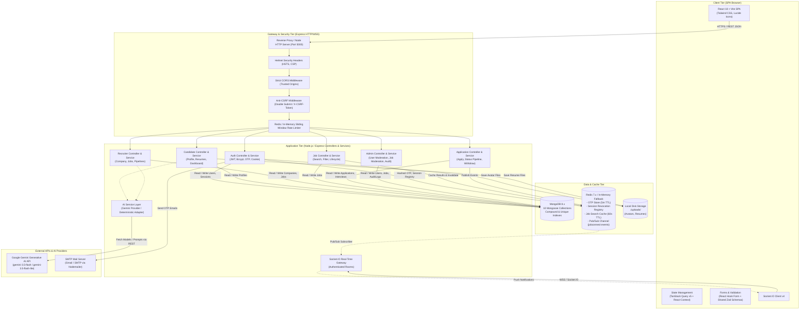

# Actual System Architecture Diagram

```mermaid
flowchart TD
    subgraph ClientTier["Client Tier (SPA Browser)"]
        SPA["React 18 + Vite SPA<br/>(Tailwind CSS, Lucide Icons)"]
        State["State Management<br/>(TanStack Query v5 + React Context)"]
        Forms["Forms & Validation<br/>(React Hook Form + Shared Zod Schemas)"]
        SocketClient["Socket.IO Client v4"]
    end

    subgraph GatewayTier["Gateway & Security Tier (Express HTTP/WSS)"]
        ReverseProxy["Reverse Proxy / Node HTTP Server (Port 5000)"]
        HelmetMW["Helmet Security Headers (HSTS, CSP)"]
        CorsMW["Strict CORS Middleware (Trusted Origins)"]
        CsrfMW["Anti-CSRF Middleware (Double Submit / X-CSRF-Token)"]
        RateLimitMW["Redis / In-Memory Sliding Window Rate Limiter"]
    end

    subgraph AppTier["Application Tier (Node.js / Express Controllers & Services)"]
        AuthCtrl["Auth Controller & Service<br/>(JWT, Bcrypt, OTP, Cookie)"]
        CandidateCtrl["Candidate Controller & Service<br/>(Profile, Resumes, Dashboard)"]
        RecruiterCtrl["Recruiter Controller & Service<br/>(Company, Jobs, Pipelines)"]
        JobCtrl["Job Controller & Service<br/>(Search, Filter, Lifecycle)"]
        AppCtrl["Application Controller & Service<br/>(Apply, Status Pipeline, Withdraw)"]
        AdminCtrl["Admin Controller & Service<br/>(User Moderation, Job Moderation, Audit)"]
        RealtimeGW["Socket.IO Real-Time Gateway<br/>(Authenticated Rooms)"]
        AIService["AI Service Layer<br/>(Gemini Provider / Deterministic Adapter)"]
    end

    subgraph DataStorageTier["Data & Cache Tier"]
        MongoDB[("MongoDB 8.x<br/>10 Mongoose Collections<br/>Compound & Unique Indexes")]
        RedisStore[("Redis 7.x / In-Memory Fallback<br/>- OTP Store (5m TTL)<br/>- Session Revocation Registry<br/>- Job Search Cache (60s TTL)<br/>- Pub/Sub Channel (jobconnect:events)")]
        DiskStorage[("Local Disk Storage<br/>./uploads/<br/>(Avatars, Resumes)")]
    end

    subgraph ExternalServices["External APIs & AI Providers"]
        GeminiAPI["Google Gemini Generative AI API<br/>(gemini-3.5-flash / gemini-3.5-flash-lite)"]
        SMTPServer["SMTP Mail Server<br/>(Gmail / SMTP via Nodemailer)"]
    end

    %% Connections
    SPA -->|HTTPS / REST JSON| ReverseProxy
    SocketClient -->|WSS / Socket.IO| RealtimeGW

    ReverseProxy --> HelmetMW --> CorsMW --> CsrfMW --> RateLimitMW

    RateLimitMW --> AuthCtrl
    RateLimitMW --> CandidateCtrl
    RateLimitMW --> RecruiterCtrl
    RateLimitMW --> JobCtrl
    RateLimitMW --> AppCtrl
    RateLimitMW --> AdminCtrl

    AuthCtrl -->|Read / Write Users, Sessions| MongoDB
    AuthCtrl -->|Hashed OTP, Session Registry| RedisStore
    AuthCtrl -->|Send OTP Emails| SMTPServer
    AuthCtrl -->|Save Avatar Files| DiskStorage

    CandidateCtrl -->|Read / Write Profiles| MongoDB
    CandidateCtrl -->|Save Resume Files| DiskStorage

    RecruiterCtrl -->|Read / Write Companies, Jobs| MongoDB
    JobCtrl -->|Read / Write Jobs| MongoDB
    JobCtrl -->|Cache Results & Invalidate| RedisStore

    AppCtrl -->|Read / Write Applications, Interviews| MongoDB
    AppCtrl -->|Publish Events| RedisStore

    AdminCtrl -->|Read / Write Users, Jobs, AuditLogs| MongoDB

    RedisStore -.->|Pub/Sub Subscriber| RealtimeGW
    RealtimeGW -.->|Push Notifications| SocketClient

    AIService -->|Fetch Models / Prompts via REST| GeminiAPI
    CandidateCtrl -.-> AIService
    RecruiterCtrl -.-> AIService
    AppTier -.-> AIService
```
