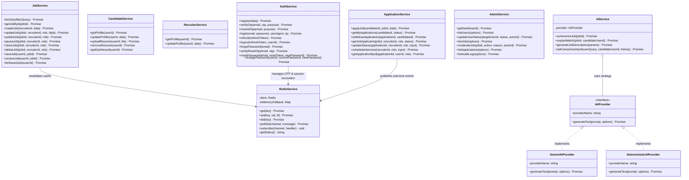

# Domain Classes and Services Diagram

```mermaid
classDiagram
    direction TB

    class AuthService {
        +register(data) Promise
        +verifyOtp(email, otp, purpose) Promise
        +resendOtp(email, purpose) Promise
        +login(email, password, userAgent, ip) Promise
        +refresh(refreshToken) Promise
        +logout(refreshToken, userId) Promise
        +forgotPassword(email) Promise
        +verifyResetOtp(email, otp) Promise
        +resetPassword(email, resetToken, newPassword) Promise
        +changePassword(userId, currentPassword, newPassword) Promise
    }

    class CandidateService {
        +getProfile(userId) Promise
        +updateProfile(userId, data) Promise
        +uploadResume(userId, file) Promise
        +removeResume(userId) Promise
        +getDashboard(userId) Promise
    }

    class RecruiterService {
        +getProfile(userId) Promise
        +updateProfile(userId, data) Promise
    }

    class JobService {
        +listJobs(filterQuery) Promise
        +getJobById(jobId) Promise
        +createJob(recruiterId, data) Promise
        +updateJob(jobId, recruiterId, role, data) Promise
        +publishJob(jobId, recruiterId, role) Promise
        +pauseJob(jobId, recruiterId, role) Promise
        +closeJob(jobId, recruiterId, role) Promise
        +deleteJob(jobId, recruiterId, role) Promise
        +saveJob(userId, jobId) Promise
        +unsaveJob(userId, jobId) Promise
        +listSavedJobs(userId) Promise
    }

    class ApplicationService {
        +applyJob(candidateId, jobId, data) Promise
        +getMyApplications(candidateId, status) Promise
        +withdrawApplication(applicationId, candidateId) Promise
        +getJobApplicants(jobId, recruiterId, role, status) Promise
        +updateStatus(applicationId, recruiterId, role, input) Promise
        +scheduleInterview(recruiterId, role, input) Promise
        +getApplicationById(applicationId, userId, role) Promise
    }

    class AdminService {
        +getDashboard() Promise
        +listUsers(options) Promise
        +updateUserStatus(targetUserId, status, actorId) Promise
        +listJobs(options) Promise
        +moderateJob(jobId, action, reason, actorId) Promise
        +listApplications(options) Promise
        +listAuditLogs(options) Promise
    }

    class RedisService {
        -client: Redis
        -inMemoryFallback: Map
        +get(key) Promise
        +set(key, val, ttl) Promise
        +del(key) Promise
        +publish(channel, message) Promise
        +subscribe(channel, handler) void
        +getStatus() string
    }

    class IAIProvider {
        <<interface>>
        +providerName: string
        +generateText(prompt, options) Promise
    }

    class GeminiAIProvider {
        +providerName: string
        +generateText(prompt, options) Promise
    }

    class DeterministicAIProvider {
        +providerName: string
        +generateText(prompt, options) Promise
    }

    class AIService {
        -provider: IAIProvider
        +summarizeJob(jobId) Promise
        +explainMatch(jobId, candidateUserId) Promise
        +generateJobDescription(params) Promise
        +askCareerAssistant(userQuery, candidateUserId, history) Promise
    }

    IAIProvider <|.. GeminiAIProvider : implements
    IAIProvider <|.. DeterministicAIProvider : implements
    AIService o-- IAIProvider : uses strategy
    JobService --> RedisService : invalidates cache
    AuthService --> RedisService : manages OTP & session revocation
    ApplicationService --> RedisService : publishes real-time events
```
