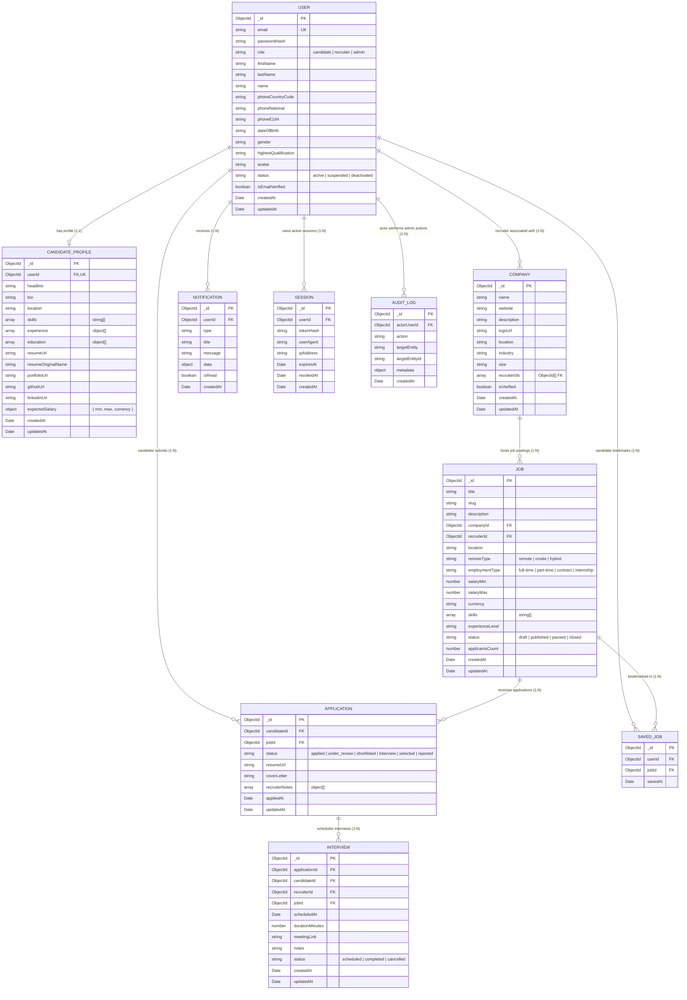

# Entity Relationship Diagram (ERD)

```mermaid
erDiagram
    USER ||--o| CANDIDATE_PROFILE : "has profile (1:1)"
    USER ||--o{ COMPANY : "recruiter associated with (1:N)"
    USER ||--o{ APPLICATION : "candidate submits (1:N)"
    USER ||--o{ SAVED_JOB : "candidate bookmarks (1:N)"
    USER ||--o{ NOTIFICATION : "receives (1:N)"
    USER ||--o{ SESSION : "owns active sessions (1:N)"
    USER ||--o{ AUDIT_LOG : "actor performs admin actions (1:N)"
    
    COMPANY ||--o{ JOB : "hosts job postings (1:N)"
    JOB ||--o{ APPLICATION : "receives applications (1:N)"
    JOB ||--o{ SAVED_JOB : "bookmarked in (1:N)"
    APPLICATION ||--o{ INTERVIEW : "schedules interviews (1:N)"

    USER {
        ObjectId _id PK
        string email UK
        string passwordHash
        string role "candidate | recruiter | admin"
        string firstName
        string lastName
        string name
        string phoneCountryCode
        string phoneNational
        string phoneE164
        string dateOfBirth
        string gender
        string highestQualification
        string avatar
        string status "active | suspended | deactivated"
        boolean isEmailVerified
        Date createdAt
        Date updatedAt
    }

    CANDIDATE_PROFILE {
        ObjectId _id PK
        ObjectId userId FK,UK
        string headline
        string bio
        string location
        array skills "string[]"
        array experience "object[]"
        array education "object[]"
        string resumeUrl
        string resumeOriginalName
        string portfolioUrl
        string githubUrl
        string linkedinUrl
        object expectedSalary "{ min, max, currency }"
        Date createdAt
        Date updatedAt
    }

    COMPANY {
        ObjectId _id PK
        string name
        string website
        string description
        string logoUrl
        string location
        string industry
        string size
        array recruiterIds "ObjectId[] FK"
        boolean isVerified
        Date createdAt
        Date updatedAt
    }

    JOB {
        ObjectId _id PK
        string title
        string slug
        string description
        ObjectId companyId FK
        ObjectId recruiterId FK
        string location
        string remoteType "remote | onsite | hybrid"
        string employmentType "full-time | part-time | contract | internship"
        number salaryMin
        number salaryMax
        string currency
        array skills "string[]"
        string experienceLevel
        string status "draft | published | paused | closed"
        number applicantsCount
        Date createdAt
        Date updatedAt
    }

    APPLICATION {
        ObjectId _id PK
        ObjectId candidateId FK
        ObjectId jobId FK
        string status "applied | under_review | shortlisted | interview | selected | rejected"
        string resumeUrl
        string coverLetter
        array recruiterNotes "object[]"
        Date appliedAt
        Date updatedAt
    }

    INTERVIEW {
        ObjectId _id PK
        ObjectId applicationId FK
        ObjectId candidateId FK
        ObjectId recruiterId FK
        ObjectId jobId FK
        Date scheduledAt
        number durationMinutes
        string meetingLink
        string notes
        string status "scheduled | completed | cancelled"
        Date createdAt
        Date updatedAt
    }

    SAVED_JOB {
        ObjectId _id PK
        ObjectId userId FK
        ObjectId jobId FK
        Date savedAt
    }

    NOTIFICATION {
        ObjectId _id PK
        ObjectId userId FK
        string type
        string title
        string message
        object data
        boolean isRead
        Date createdAt
    }

    SESSION {
        ObjectId _id PK
        ObjectId userId FK
        string tokenHash
        string userAgent
        string ipAddress
        Date expiresAt
        Date revokedAt
        Date createdAt
    }

    AUDIT_LOG {
        ObjectId _id PK
        ObjectId actorUserId FK
        string action
        string targetEntity
        string targetEntityId
        object metadata
        Date createdAt
    }
```
