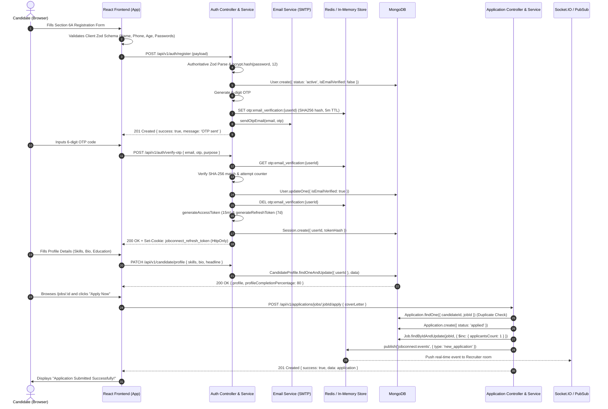

# Sequence Diagram: Journey 1 — Candidate Registration to Job Application

```mermaid
sequenceDiagram
    autonumber
    actor Candidate as Candidate (Browser)
    participant FE as React Frontend (App)
    participant AuthCtrl as Auth Controller & Service
    participant Mail as Email Service (SMTP)
    participant Redis as Redis / In-Memory Store
    participant Mongo as MongoDB
    participant AppCtrl as Application Controller & Service
    participant PubSub as Socket.IO / PubSub

    %% Step 1: Register
    Candidate->>FE: Fills Section 6A Registration Form
    FE->>FE: Validates Client Zod Schema (Name, Phone, Age, Passwords)
    FE->>AuthCtrl: POST /api/v1/auth/register (payload)
    AuthCtrl->>AuthCtrl: Authoritative Zod Parse & bcrypt.hash(password, 12)
    AuthCtrl->>Mongo: User.create({ status: 'active', isEmailVerified: false })
    AuthCtrl->>AuthCtrl: Generate 6-digit OTP
    AuthCtrl->>Redis: SET otp:email_verification:{userId} (SHA256 hash, 5m TTL)
    AuthCtrl->>Mail: sendOtpEmail(email, otp)
    AuthCtrl-->>FE: 201 Created { success: true, message: 'OTP sent' }

    %% Step 2: Verify OTP
    Candidate->>FE: Inputs 6-digit OTP code
    FE->>AuthCtrl: POST /api/v1/auth/verify-otp { email, otp, purpose }
    AuthCtrl->>Redis: GET otp:email_verification:{userId}
    AuthCtrl->>AuthCtrl: Verify SHA-256 match & attempt counter
    AuthCtrl->>Mongo: User.updateOne({ isEmailVerified: true })
    AuthCtrl->>Redis: DEL otp:email_verification:{userId}
    AuthCtrl->>AuthCtrl: generateAccessToken (15m) & generateRefreshToken (7d)
    AuthCtrl->>Mongo: Session.create({ userId, tokenHash })
    AuthCtrl-->>FE: 200 OK + Set-Cookie: jobconnect_refresh_token (HttpOnly)

    %% Step 3: Complete Profile
    Candidate->>FE: Fills Profile Details (Skills, Bio, Education)
    FE->>AuthCtrl: PATCH /api/v1/candidate/profile { skills, bio, headline }
    AuthCtrl->>Mongo: CandidateProfile.findOneAndUpdate({ userId }, data)
    Mongo-->>FE: 200 OK { profile, profileCompletionPercentage: 80 }

    %% Step 4: Apply for Job
    Candidate->>FE: Browses /jobs/:id and clicks "Apply Now"
    FE->>AppCtrl: POST /api/v1/applications/jobs/:jobId/apply { coverLetter }
    AppCtrl->>Mongo: Application.findOne({ candidateId, jobId }) (Duplicate Check)
    AppCtrl->>Mongo: Application.create({ status: 'applied' })
    AppCtrl->>Mongo: Job.findByIdAndUpdate(jobId, { $inc: { applicantsCount: 1 } })
    AppCtrl->>Redis: publish('jobconnect:events', { type: 'new_application' })
    Redis-->>PubSub: Push real-time event to Recruiter room
    AppCtrl-->>FE: 201 Created { success: true, data: application }
    FE->>Candidate: Displays "Application Submitted Successfully!"
```
