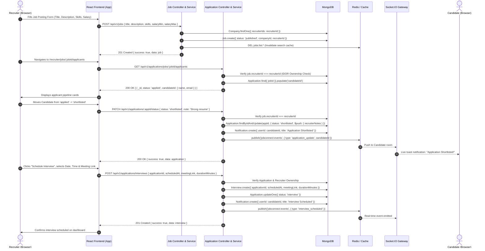

# Sequence Diagram: Journey 2 — Recruiter Job Posting to Interview Scheduling

```mermaid
sequenceDiagram
    autonumber
    actor Recruiter as Recruiter (Browser)
    participant FE as React Frontend (App)
    participant JobCtrl as Job Controller & Service
    participant AppCtrl as Application Controller & Service
    participant Mongo as MongoDB
    participant Redis as Redis / Cache
    participant PubSub as Socket.IO Gateway
    actor Candidate as Candidate (Browser)

    %% Step 1: Create Job Posting
    Recruiter->>FE: Fills Job Posting Form (Title, Description, Skills, Salary)
    FE->>JobCtrl: POST /api/v1/jobs { title, description, skills, salaryMin, salaryMax }
    JobCtrl->>Mongo: Company.findOne({ recruiterIds: recruiterId })
    JobCtrl->>Mongo: Job.create({ status: 'published', companyId, recruiterId })
    JobCtrl->>Redis: DEL jobs:list:* (Invalidate search cache)
    JobCtrl-->>FE: 201 Created { success: true, data: job }

    %% Step 2: Review Applicants
    Recruiter->>FE: Navigates to /recruiter/jobs/:jobId/applicants
    FE->>AppCtrl: GET /api/v1/applications/jobs/:jobId/applicants
    AppCtrl->>Mongo: Verify job.recruiterId === recruiterId (IDOR Ownership Check)
    AppCtrl->>Mongo: Application.find({ jobId }).populate('candidateId')
    AppCtrl-->>FE: 200 OK [ { _id, status: 'applied', candidateId: { name, email } } ]
    FE->>Recruiter: Displays applicant pipeline cards

    %% Step 3: Advance Stage Pipeline
    Recruiter->>FE: Moves Candidate from 'applied' -> 'shortlisted'
    FE->>AppCtrl: PATCH /api/v1/applications/:appId/status { status: 'shortlisted', note: 'Strong resume' }
    AppCtrl->>Mongo: Verify job.recruiterId === recruiterId
    AppCtrl->>Mongo: Application.findByIdAndUpdate(appId, { status: 'shortlisted', $push: { recruiterNotes } })
    AppCtrl->>Mongo: Notification.create({ userId: candidateId, title: 'Application Shortlisted' })
    AppCtrl->>Redis: publish('jobconnect:events', { type: 'application_update', candidateId })
    Redis-->>PubSub: Push to Candidate room
    PubSub-->>Candidate: Live toast notification: "Application Shortlisted!"
    AppCtrl-->>FE: 200 OK { success: true, data: application }

    %% Step 4: Schedule Interview
    Recruiter->>FE: Clicks "Schedule Interview", selects Date, Time & Meeting Link
    FE->>AppCtrl: POST /api/v1/applications/interviews { applicationId, scheduledAt, meetingLink, durationMinutes }
    AppCtrl->>Mongo: Verify Application & Recruiter Ownership
    AppCtrl->>Mongo: Interview.create({ applicationId, scheduledAt, meetingLink, durationMinutes })
    AppCtrl->>Mongo: Application.updateOne({ status: 'interview' })
    AppCtrl->>Mongo: Notification.create({ userId: candidateId, title: 'Interview Scheduled' })
    AppCtrl->>Redis: publish('jobconnect:events', { type: 'interview_scheduled' })
    Redis-->>PubSub: Real-time event emitted
    AppCtrl-->>FE: 201 Created { success: true, data: interview }
    FE->>Recruiter: Confirms interview scheduled on dashboard
```
